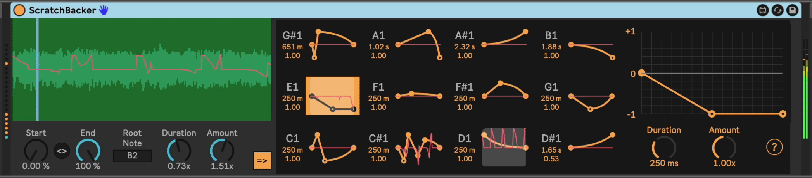

# ScratchBacker

This is a sample-playback device with a focus on turntablism effects (scratching).

You can define up to 12 different scratch presets, then trigger them with the notes C1-B1.

Playing higher notes will play back a sample, relative to a `Root Note` that you can set.

So a typical way to use this device is to drop a sample on the sample drop area, then hold a note (e.g. C3) to play back a sample while triggering scratching by tapping scratch trigger notes (e.g. C1).

[View an Overview Video](https://youtu.be/G8T77lcQroA)

## Installation

Download the newest .amxd file from the [Releases page](https://github.com/zsteinkamp/m4l-ScratchBacker/releases), or clone this repository and drag the `ScratchBacker.amxd` device into a track in Ableton Live.

## Changelog

* 2024-11-13 [v2](https://github.com/zsteinkamp/m4l-ScratchBacker/releases/download/v2/ScratchBacker-v2.amxd) - Visual improvements, clean up implementation for Max divers.
* 2024-11-11 [v1](https://github.com/zsteinkamp/m4l-ScratchBacker/releases/download/v1/ScratchBacker-v1.amxd) - Initial release.

## Controls

* *Sample Drop* - Drop a sample or clip.
* *Loop Start* - Start point in the sample.
* *Loop End* - End point of the sample loop.
* *Root Note* - Base pitch of the dropped sample.
* *Duration* - Global scale for scratch preset duration.
* *Amount* - Global scale for scratch preset amount.
* *Auto Select* - When engaged, will select the given scratch preset when it is triggered. Similar to the same function in Ableton Drum Racks that select a chain when a corresponding note is received.
* *Scratch Preset* - Click one of the 12 preset slots to edit that slot. Change the function (change curves by holding Alt, remove points by Shift-clicking them), duration, or amount. Changes are automatically saved to the scratch preset slot.

## TODO

* ...

## Contributing

I'd love it if others extended this device. If you would like to contribute, simply fork this repo, make your changes, and open a pull request and I'll have a look.
